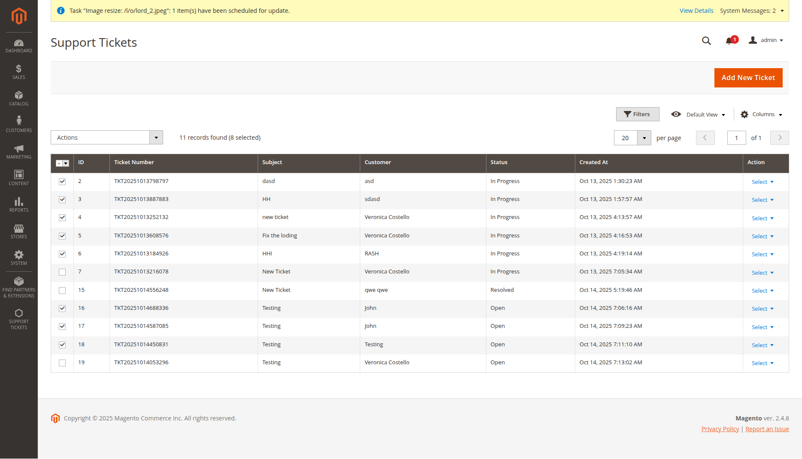

# Support Ticket System - Business Requirements

## Project Introduction

The Support Ticket System is a comprehensive customer support solution integrated into Magento 2. It allows customers to
submit support requests, track their tickets, and communicate with support staff. Administrators can manage all tickets,
assign priorities, categorize issues, and respond to customer inquiries through a dedicated admin interface.

## Storefront Requirements

### Header Integration

- **Submit Ticket Link**: A prominent "Submit Ticket" link should appear in the top header next to the Sign In link
- **Visual Style**: White text color to stand out against the header background
- **Responsive**: Link should be visible and accessible on all device sizes

### Floating Support Button

- **Position**: Fixed floating button on the bottom-right corner of all storefront pages
- **Design**: Circular button with support icon (question mark or chat bubble)
- **Behavior**: Clicking opens the ticket submission form
- **Visibility**: Always visible but doesn't obstruct page content

  
Click to see image

### Guest User Capabilities

- **Ticket Submission**: Can create support tickets without account registration
- **Required Information**:
    - Full name (text input)
    - Email address (email validation)
    - Subject line (required)
    - Detailed description (textarea)
    - Category selection (dropdown)
    - Priority selection (dropdown)
- **Form Validation**: Real-time validation with clear error messages
- **Success Confirmation**: Clear success message with ticket number after submission
- **No Ticket Access**: Cannot view previously submitted tickets (security measure)

  
Click to see images

### Logged-in User Capabilities

- **All Guest Features**: Can perform all guest user actions
- **Auto-populated Data**: Name and email automatically filled from customer account
- **My Tickets Tab**: Dedicated tab showing all their submitted tickets
- **Ticket List View**:
    - Ticket subject and number
    - Current status with color-coded badges
    - Creation date and last reply date
    - Truncated description preview
    - "View Details" button for each ticket
- **Ticket Detail View**:
    - Full ticket information display
    - Complete message history (customer and admin messages)
    - Reply functionality to add new messages
    - "View All My Tickets" button in header
    - "Back to All Tickets" and "Create New Ticket" buttons at bottom
- **Security**: Can only access tickets associated with their email address

  
Click to see images

### Customer Account Integration

- **Navigation Link**: "My Support Tickets" link in customer account sidebar
- **Direct Access**: Clicking takes user to their ticket list page
- **Consistent Experience**: Same interface as the main ticket system

  
Click to see images

## Admin Panel Requirements

### Main Menu Structure

- **Primary Menu**: "Support Tickets" in main admin navigation
- **Submenu Items**:
    - "Tickets" - Main ticket management
    - "Categories" - Ticket category management
    - "Priorities" - Ticket priority management

  
Click to see images

### Tickets Management Tab

- **Grid View**:
    - Sortable columns: Ticket Number, Subject, Customer Name, Status, Priority, Category, Created Date, Last Reply
    - Filter options for each column
    - Search functionality across all fields
    - Pagination for large datasets
    - Bulk selection checkboxes
- **Mass Actions Dropdown**:
    - "Delete" - Remove selected tickets
    - "Mark as Open" - Change status to open
    - "Mark as In Progress" - Change status to in progress
    - "Mark as Waiting for Customer" - Change status to waiting
    - "Mark as Resolved" - Change status to resolved
    - "Mark as Closed" - Change status to closed
- **Individual Actions**:
    - "View" - Open ticket detail view
    - "Edit" - Open ticket edit form
    - "Delete" - Remove single ticket (with confirmation popup)

  
Click to see images

### Ticket Detail View

- **Header Section**:
    - Ticket number and subject prominently displayed
    - Status badge with color coding
    - Creation date and last activity
- **Ticket Information**:
    - Customer details (name, email)
    - Category and priority
    - Full description
    - Status history timeline
- **Messages Section**:
    - Chronological message list
    - Sender identification (Customer/Admin)
    - Message timestamps
    - Internal message option (admin-only, not visible to customer)
- **Add Message Form**:
    - Text area for new message
    - "Internal Message" checkbox for admin notes
    - Send button to submit message

  
Click to see images

### Ticket Edit Form

- **Editable Fields**:
    - Subject line
    - Description
    - Status dropdown (open, in progress, waiting for customer, resolved, closed)
    - Priority selection
    - Category selection
    - Assigned admin user (dropdown of admin users)
- **Non-editable Fields**:
    - Ticket number
    - Customer name and email
    - Creation date
    - Last activity date
    - **Change History**: Log of changes made to ticket details
- **Form Validation**: Client and server-side validation
- **Save Actions**: Save and Continue, Save and Close, Cancel

  
Click to see images

### Categories Management Tab

- **Grid View**:
    - Columns: Name, Description, Active Status, Sort Order, Actions
    - Filter and search capabilities
    - Bulk selection and mass delete
- **Add/Edit Form**:
    - Category name (required)
    - Description (optional)
    - Active status toggle
    - Sort order number
- **Actions**: View, Edit, Delete for each category

  
Click to see images

### Priorities Management Tab

- **Grid View**:
    - Columns: Name, Description, Color, Active Status, Sort Order, Actions
    - Filter and search capabilities
    - Bulk selection and mass delete
- **Add/Edit Form**:
    - Priority name (required)
    - Description (optional)
    - Color picker for visual identification
    - Active status toggle
    - Sort order number
- **Actions**: View, Edit, Delete for each priority

  
Click to see images

## User Experience Requirements

### Visual Design

- **Status Color Coding**:
    - Open: Green
    - In Progress: Yellow/Orange
    - Waiting for Customer: Blue
    - Resolved: Light Blue
    - Closed: Red/Gray
- **Responsive Design**: Fully functional on desktop, tablet, and mobile
- **Loading States**: Spinner or progress indicators for form submissions
- **Error Handling**: Clear, user-friendly error messages

### Navigation Flow

- **Guest Flow**: Header Link → Form → Success → Login Prompt
- **Customer Flow**: Header Link → Form with My Tickets Tab → Ticket List → Ticket Detail
- **Admin Flow**: Menu → Grid → View/Edit → Save/Delete

### Security Requirements

- **Customer Access**: Users can only view their own tickets
- **Admin Authentication**: All admin functions require proper authentication
- **Data Validation**: All inputs validated and sanitized
- **CSRF Protection**: Forms protected against cross-site request forgery

## Success Metrics

- **User Adoption**: High usage of ticket submission system
- **Response Time**: Quick admin response to new tickets
- **User Satisfaction**: Easy ticket submission and tracking
- **Admin Efficiency**: Streamlined ticket management workflow
- **Data Integrity**: No unauthorized access to ticket data

